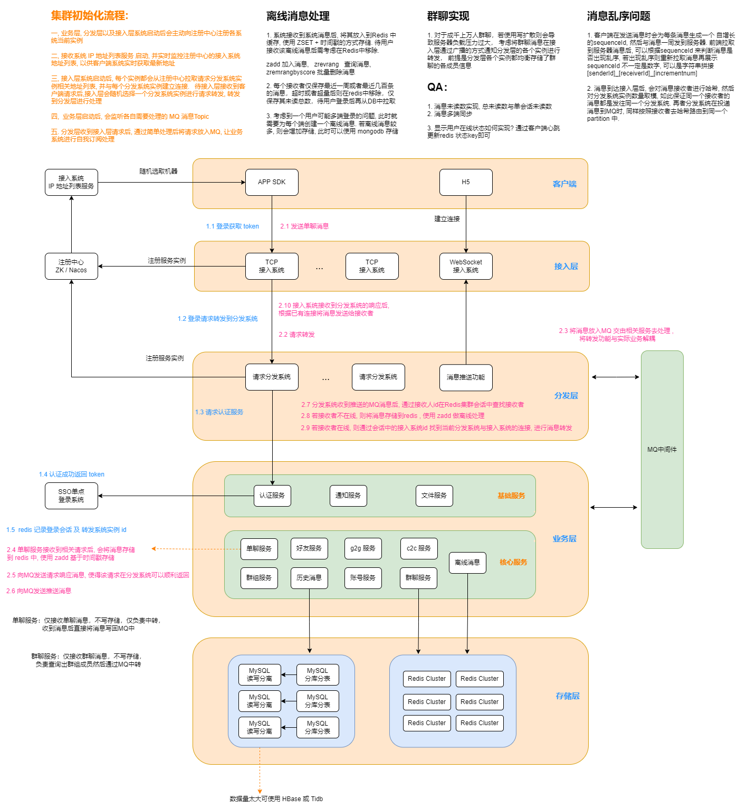

## IM 消息系统



### 待处理
1. 分发系统掉线后, gateway接入系统如何感知并重连. 同样, gateway接入系统掉线后, App端如何处理?
2. gateway接入系统掉线重启后, 如何找回掉线前的会话信息以及与客户端的连接?
3. 无论客户端及服务端， 在接收数据请求时需将处理逻辑放到异步线程进行处理，如放入阻塞队列中，而后由异步线程接收处理。有关阻塞队列， 建议使用 Disruptor


### 单机百万连接测试

为能够模拟真实环境测试，所以准备了两台 Linux 机器，统一4核4G内存. 正常一台机器仅有6万多端口可用, 若服务端仅监听一个端口, 那么估计需要17台客户端机器才可以实现百万连接, 而如果服务端监听多个端口, 那么客户端需要的数量就可以很少了. 所以可以再服务器端监听 20 个端口, 然后客户端使用6万个端口进行连接, 这样就可以轻松完成百万连接, 建议使用两台物理机, 可以是物理机上装的虚拟机, 但是必须是两台物理机, 最好不要使用一台物理机安装几个虚拟机来完成, 因为这样的测试效果不理想, 连接也很慢.

#### 1. 服务器参数调整

1. 1 配置用户级文件句柄打开数

   root 身份下编辑 /etc/security/limits.conf

   ```shell
   root soft nofile 1000000
   root hard nofile 1000000
   * soft nofile 1000000
   * hard nofile 1000000
   ```

2. 修改全局文件句柄限制

   > cat /proc/sys/fs/file-max

   vi /etc/sysctl.conf

   ```
   fs.file-max = 1000000
   fs.nr_open = 1000000
   net.ipv4.ip_local_port_range = 5000 65000
   ```

   使其生效：sysctl -p

   然后 reboot 重启服务器

3. 调整端口范围

   vi /etc/sysctl.conf

   ```sh
   net.ipv4.ip_local_port_range = 5000 65000
   ```


> windows 系统参数调整 : 
>
> 1、请以管理员身份打开 CMD，运行如下命令：
> netsh interface ipv4 show tcpstats
> netsh int ipv4 show dynamicport tcp
> 查看一下，是否端口耗尽，目前端口数量是多少，如果确认端口耗尽。
>
> 2、增大动态端口数量, 该步骤无需重启机器，立即生效
> netsh int ipv4 set dynamicport tcp start=1025 num=60000
>
> 3、调整注册表:  在CMD输入regedit, 然后找到 [HKEY_LOCAL_MACHINE \System \CurrentControlSet \Services \Tcpip \Parameters], 最后新建下面的Dword值
>
> 最大允许的 TCP 连接数：TcpNumConnections = 1000000
> 最大动态端口数 ：MaxUserPort = 65534
> 最大 TCB 数量 ：MaxFreeTcbs = 16000
> 最大 TCB Hash table 数量 ：MaxHashTableSize = 65536


#### 2. 开始测试

```shell
java -jar million-server.jar  -Xms4g -Xmx4g -XX:NewSize=4g -XX:MaxNewSize=4g

java -jar million-client.jar  -Xms2g -Xmx2g -XX:NewSize=2g -XX:MaxNewSize=2g
```

经过长时间的测试, 实际百万连接不容易达成, 因为没有足够的物理机, 导致连接很慢, 测试使用的服务端是win10 中的虚拟机, 客户端是MacBook, 以及与服务端同在一台物理机的三台虚拟机. 一个多小时过去了, 连接数才达到了三十多万... 另外使用Windows 系统做客户端时, 当连接到达一定量后经常提示 no buffer space available, 寻求很多解决方式都无法处理, 所以测试还得是Linux系统.
